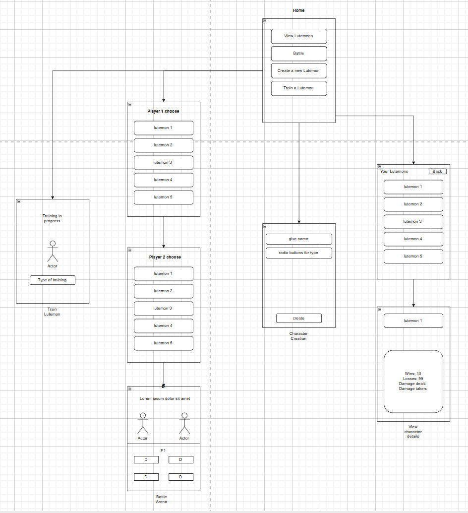

# Android application: Turn based lutemon game
Project to learn android development with Java. A turn based lutemon battle system, with logic to manage lutemons
and fight them splitting the screen with another player couch co-op style

## Features
+ Turn based battle loop
+ lutemon manager with custom lutemon creation
+ Lutemons have statistics like health, strength, and speed
+ Lutemons can level up and increase their stats
+ when lutemon is created, stats get randomly assigned based on limited bell curve
+ lutemon types have different attacks and other abilities
+ lutemon manager tracks wins, losses, and other statistics

## How to use
Source code can be accessed with android studio and it can be downloaded to a connected phone

## UML

